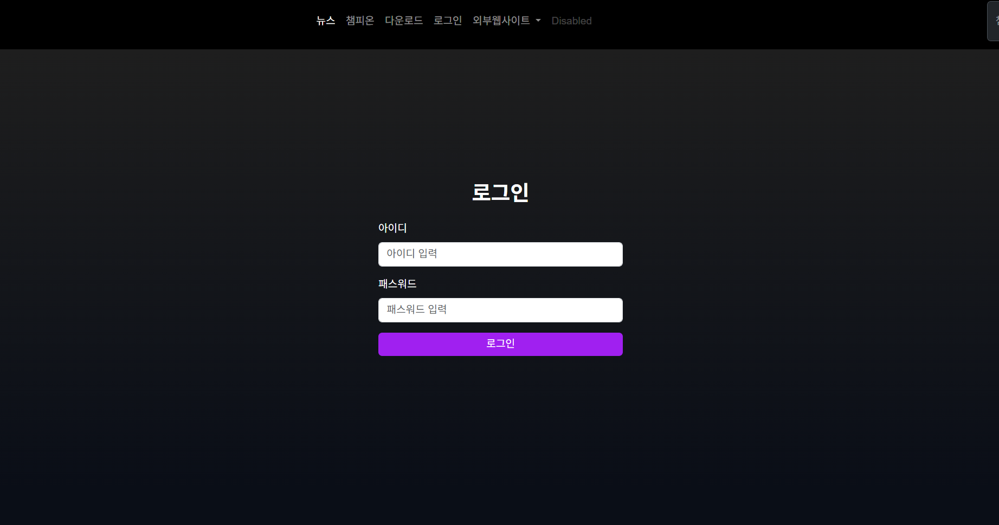
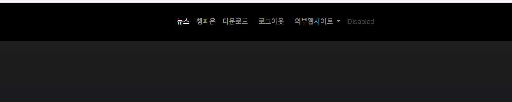
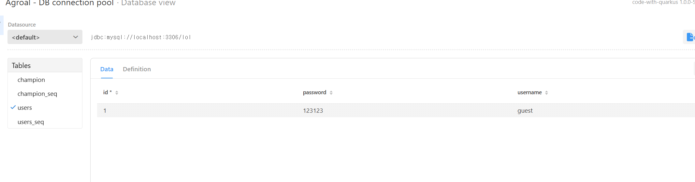
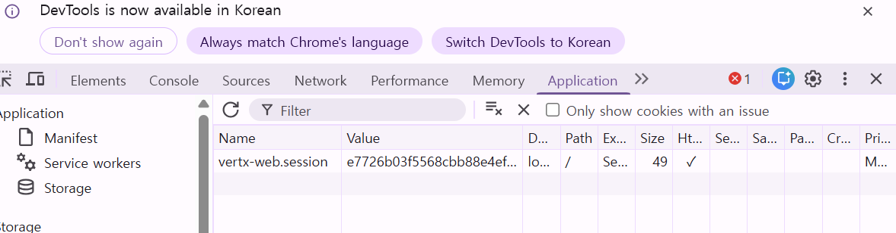
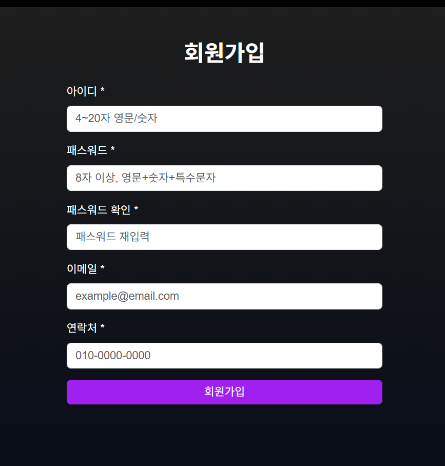
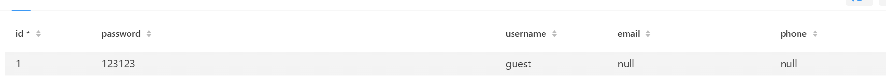
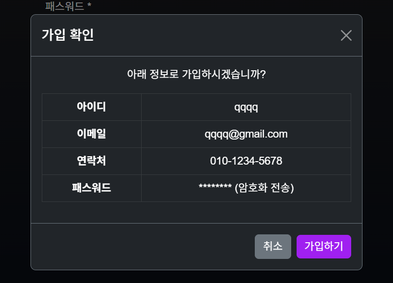
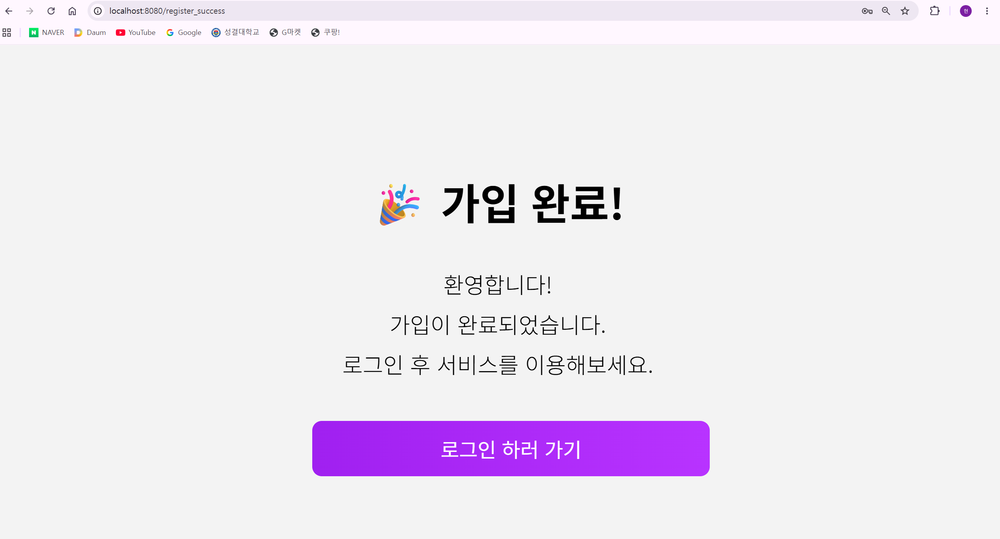
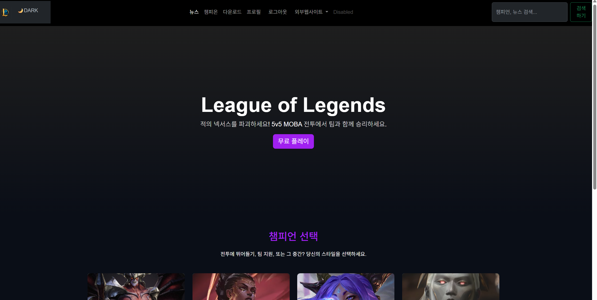
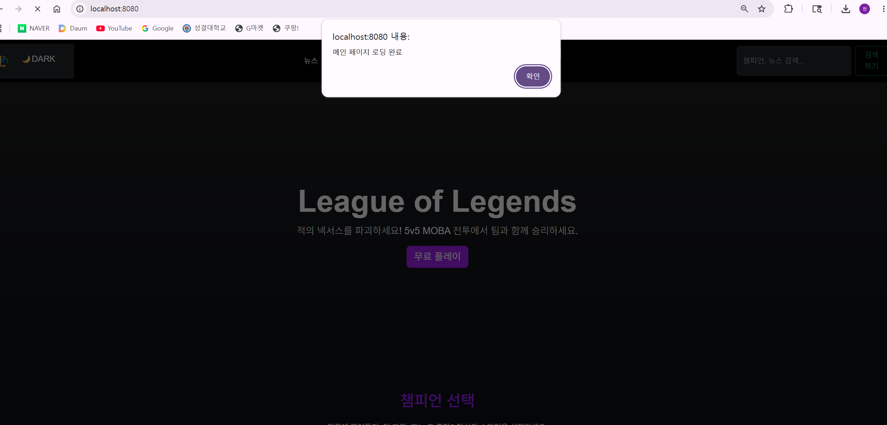

# quarkus 프로젝트 시작! (학번 : 20250589 이름 : 김가현)

매 주 수업 내용을 정리하자.

## 2, 3주차 수업 내용
실습 1 : 쿼크스 환경 구축 및 준비 완료!
실습 2 : HTML 기본 및 LOL 메인 화면 개발 완료!

## 4주차 수업 내용
1: 하이퍼링크와 이미지 
2: 네비게이션 바 수정
3: 챔피언 카드 추가
4: 모달창 추가하기

 

## 5주차 수업 내용
1: 모달창 구성하기
2: 다운로드 페이지 추가하기
3: 다운로드 css 추가하기

 

## 6주차 수업 내용
1: js 폴더 생성하기
2: Js 폴더에 test.js 파일 생성
3: 검색창 구글에 연동하기

 

## 7주차 수업 내용

1: 실시간 챔피언 검색하기
2: main.css 추가하기
3: search.js 수정하기

 

## 9주차 수업 내용 

1: html토글, css버튼, 토글함수를 추가하여 첫 lol 페이지 다크모드/ 라이트 모드 전환하기
2: pom.xml 파일 코드를 수정하여 프로젝트 내부 의존성 추가
3: 데이터 베이스 연동하여 챔피온 정보확인, sql 제어편리

 

## 10주차 수업 내용 

1: 로그인과 로그아웃 페이지 추가
2: AuthResource.java, User.java,DataSeedar.java, login 파일 추가
3:  임시 사용자 데이터 삽입

 

## 11주차 수업 내용

1: 세션 활성화 설정 추가
2: DB 사용자 체크
3: /logout 로그아웃 엔드포인트
4: 회원가입 페이지 추가
5: 회원 테이블 수정
6: SHA-256 해시, 모달창을 사용해 가입확인창 추가
7: 가입완료 페이지 추가

  
  

  
  

  

## 12주차 수업 내용
1: 메인 페이지 이름 변경
2: 로그인 후 로그아웃 버튼 생성

